# DENR Permit System - Data Flow Diagrams & Flowcharts

## Table of Contents
1. [System Architecture Overview](#1-system-architecture-overview)
2. [User Role Flows](#2-user-role-flows)
3. [Page-Level CRUD Operations](#3-page-level-crud-operations)
4. [Event Flow Diagrams](#4-event-flow-diagrams)
5. [Database Schema Relationships](#5-database-schema-relationships)

---

## 1. System Architecture Overview

### 1.1 High-Level System Architecture

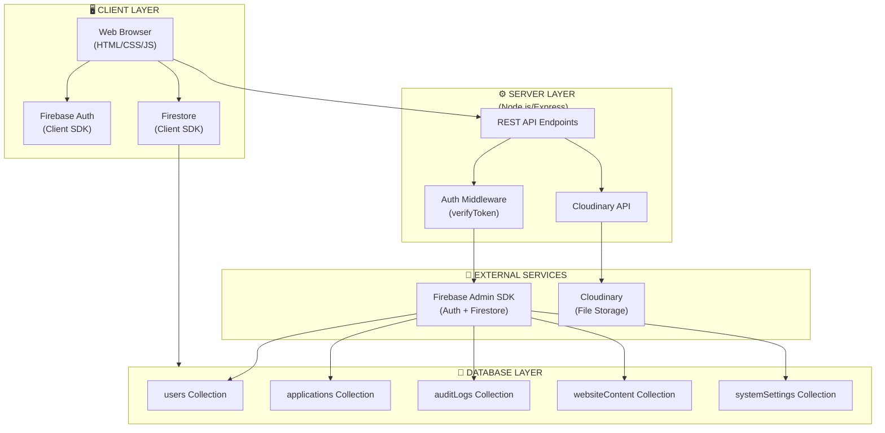

### 1.2 Authentication Flow

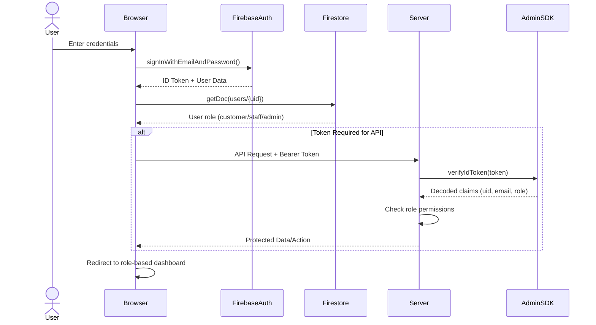

---

## 2. User Role Flows

### 2.1 Customer Workflow

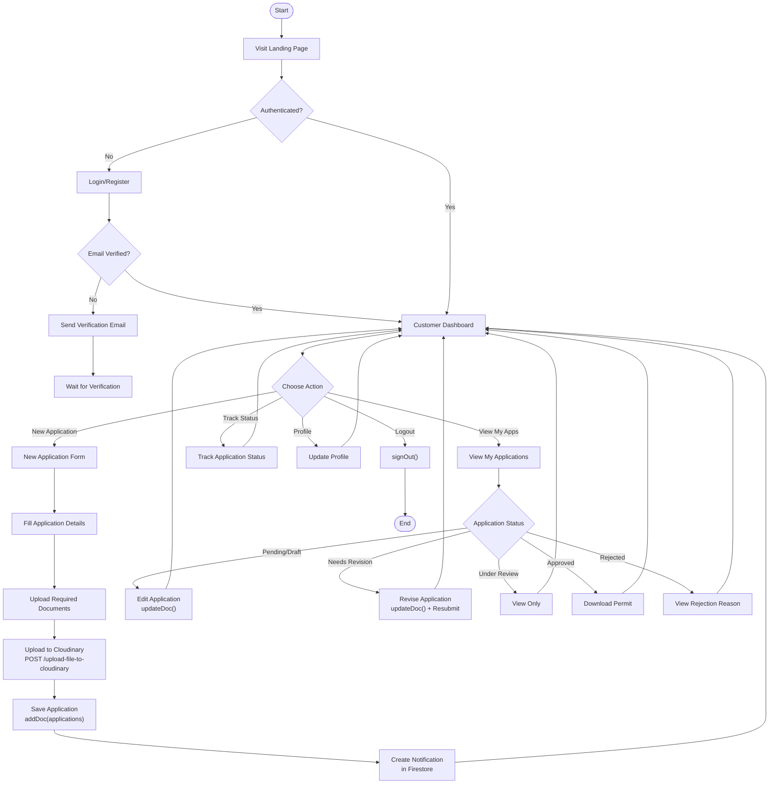

### 2.2 Staff Workflow

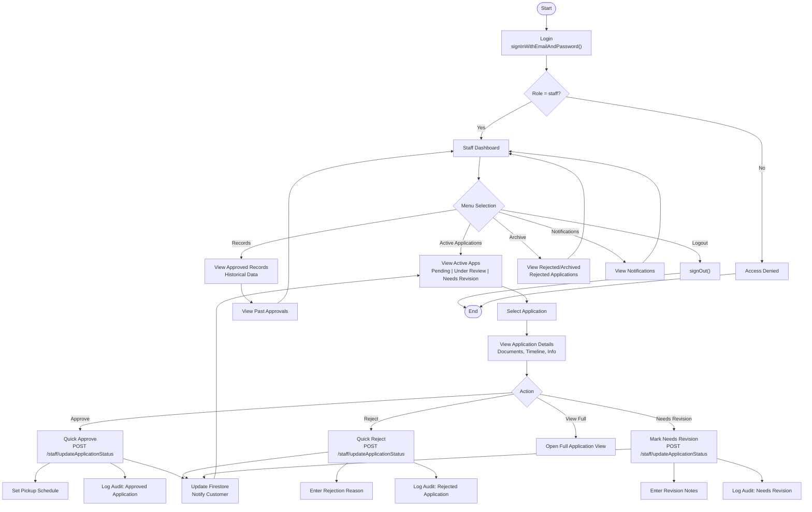

### 2.3 Admin Workflow

```mermaid
flowchart TD
    START([Start]) --> LOGIN["Login\nsignInWithEmailAndPassword()"]
    LOGIN --> VERIFY_ROLE{Role = admin?}
    VERIFY_ROLE -->|No| CHECK_STAFF{Role = staff?}
    CHECK_STAFF -->|Yes| STAFF_VIEW[Redirect to Staff View]
    CHECK_STAFF -->|No| ACCESS_DENIED[Access Denied]
    VERIFY_ROLE -->|Yes| ADMIN_DASH[Admin Dashboard]
    
    ADMIN_DASH --> MENU{Menu Selection}
    
    MENU -->|Dashboard| DASH_VIEW["View System Overview\nAnalytics & Statistics"]
    DASH_VIEW --> GET_STATS["GET /admin/analytics"]
    GET_STATS --> UPDATE_CHARTS[Update Charts/Graphs]
    UPDATE_CHARTS --> ADMIN_DASH
    
    MENU -->|Applications| APPS_SECTION["Applications Management\nCRUD Operations"]
    APPS_SECTION --> LIST_ALL["List All Applications\nquery(applications)"]
    LIST_ALL --> APP_ACTIONS{Actions}
    APP_ACTIONS -->|View| VIEW_APP["View Application Details"]
    APP_ACTIONS -->|Update Status| UPDATE_STATUS["Update Status\nSame as Staff Flow"]
    APP_ACTIONS -->|Delete| DELETE_APP["Delete Application\ndeleteDoc()"]
    APP_ACTIONS -->|Export| EXPORT_APPS["Export to Excel/PDF"]
    VIEW_APP --> LIST_ALL
    UPDATE_STATUS --> LIST_ALL
    DELETE_APP --> LIST_ALL
    EXPORT_APPS --> LIST_ALL
    
    MENU -->|Records| RECORDS_SECTION["Records Section\nApproved Applications"]
    RECORDS_SECTION --> VIEW_RECORDS["View Historical Records"]
    VIEW_RECORDS --> EXPORT_RECORDS["Export Records"]
    EXPORT_RECORDS --> ADMIN_DASH
    
    MENU -->|Manage Users| USERS_SECTION["User Management\nCRUD Operations"]
    USERS_SECTION --> LIST_USERS["GET /admin/users"]
    LIST_USERS --> USER_ACTIONS{User Actions}
    
    USER_ACTIONS -->|Create Staff| CREATE_STAFF["POST /admin/createStaff"]
    CREATE_STAFF --> ENTER_DETAILS["Enter: email, password, displayName"]
    ENTER_DETAILS --> SET_ROLE["Set Custom Claim: role=staff"]
    SET_ROLE --> SAVE_TO_DB["Save to users Collection"]
    SAVE_TO_DB --> LOG_AUDIT["Log Audit: Staff Account Created"]
    
    USER_ACTIONS -->|View User| VIEW_USER["View User Details"]
    USER_ACTIONS -->|Deactivate| DEACTIVATE["POST /admin/users/{id}/status"]
    USER_ACTIONS -->|Delete| DELETE_USER["Delete User Account"]
    
    LOG_AUDIT --> LIST_USERS
    VIEW_USER --> LIST_USERS
    DEACTIVATE --> LIST_USERS
    DELETE_USER --> LIST_USERS
    
    MENU -->|Reports| REPORTS_SECTION["Reports & Analytics"]
    REPORTS_SECTION --> GENERATE_REPORT["Generate Custom Reports"]
    GENERATE_REPORT --> EXPORT["Export to Excel/PDF"]
    EXPORT --> ADMIN_DASH
    
    MENU -->|Content| CONTENT_SECTION["Content Management"]
    CONTENT_SECTION --> MANAGE_CONTENT{Manage}
    
    MANAGE_CONTENT -->|Announcements| ANNOUNCEMENTS["Manage Announcements\naddDoc/updateDoc/deleteDoc"]
    MANAGE_CONTENT -->|Welcome Message| WELCOME["Update Welcome Message"]
    MANAGE_CONTENT -->|Permit Types| PERMIT_TYPES["Manage Permit Types"]
    MANAGE_CONTENT -->|FAQs| FAQS["Manage FAQs"]
    MANAGE_CONTENT -->|Contact Info| CONTACT["Update Contact Information"]
    
    ANNOUNCEMENTS --> CONTENT_SECTION
    WELCOME --> CONTENT_SECTION
    PERMIT_TYPES --> CONTENT_SECTION
    FAQS --> CONTENT_SECTION
    CONTACT --> CONTENT_SECTION
    
    MENU -->|Audit Logs| AUDIT_SECTION["Audit Log Viewer"]
    AUDIT_SECTION --> GET_LOGS["GET /admin/audit-logs"]
    GET_LOGS --> DISPLAY_LOGS["Display: User, Action, Timestamp, Details"]
    DISPLAY_LOGS --> FILTER_LOGS["Filter by Date/User/Action"]
    FILTER_LOGS --> EXPORT_LOGS["Export Audit Logs"]
    EXPORT_LOGS --> ADMIN_DASH
    
    MENU -->|Settings| SETTINGS_SECTION["System Settings"]
    SETTINGS_SECTION --> SETTINGS_TABS{Settings Tabs}
    
    SETTINGS_TABS -->|Maintenance| MAINTENANCE["Maintenance Mode\nToggle + Message"]
    SETTINGS_TABS -->|Security| SECURITY["Security Settings\nSession Timeout"]
    SETTINGS_TABS -->|Notifications| NOTIFS["Notification Preferences"]
    
    MAINTENANCE --> SAVE_MAINT["saveMaintenanceSettings()\naddDoc/updateDoc systemSettings"]
    SECURITY --> SAVE_SEC["saveSecuritySettings()\naddDoc/updateDoc systemSettings"]
    NOTIFS --> SAVE_NOTIF["saveNotificationSettings()\naddDoc/updateDoc systemSettings"]
    
    SAVE_MAINT --> ADMIN_DASH
    SAVE_SEC --> ADMIN_DASH
    SAVE_NOTIF --> ADMIN_DASH
    
    MENU -->|Logout| LOGOUT["signOut()"]
    LOGOUT --> END([End])
    
    STAFF_VIEW --> END
    ACCESS_DENIED --> END
```

---

## 3. Page-Level CRUD Operations

### 3.1 Customer Dashboard (`customer-dashboard.html`)

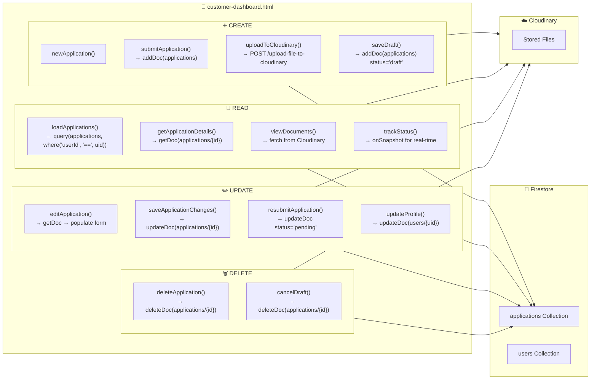

### 3.2 Staff Dashboard (`staff-dashboard.html`)

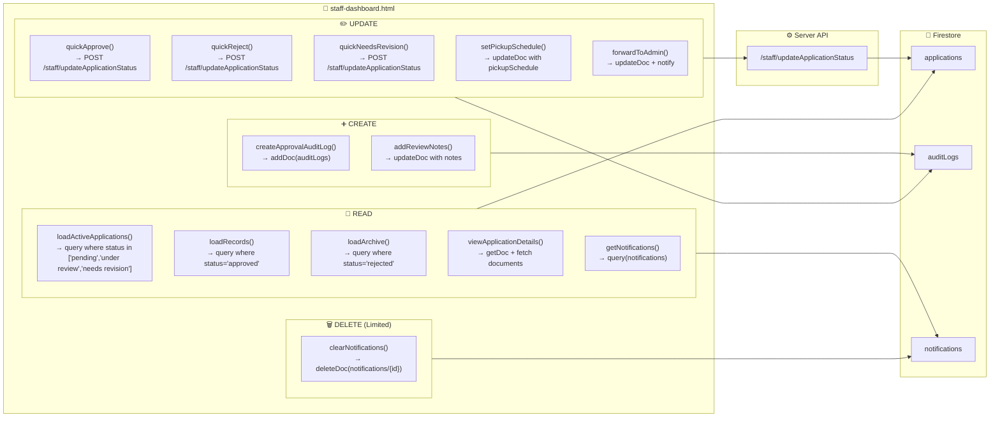

### 3.3 Admin Dashboard (`admin-dashboard.html`)

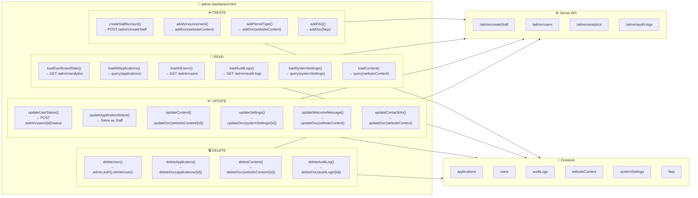

### 3.4 Landing Page (`index.html`) & Public Pages

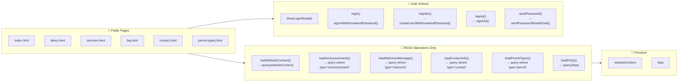

---

## 4. Event Flow Diagrams

### 4.1 Application Submission Flow

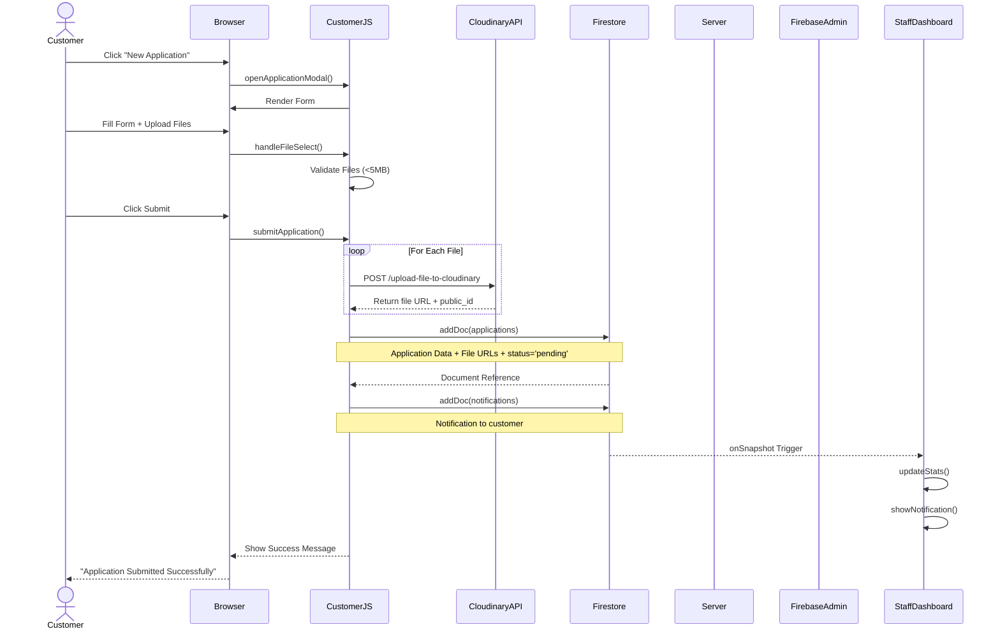

### 4.2 Application Review & Approval Flow

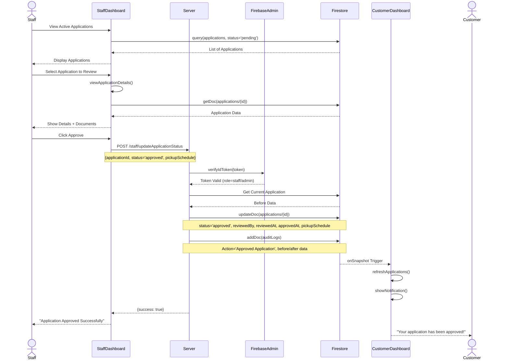

### 4.3 Staff Account Creation Flow (Admin Only)

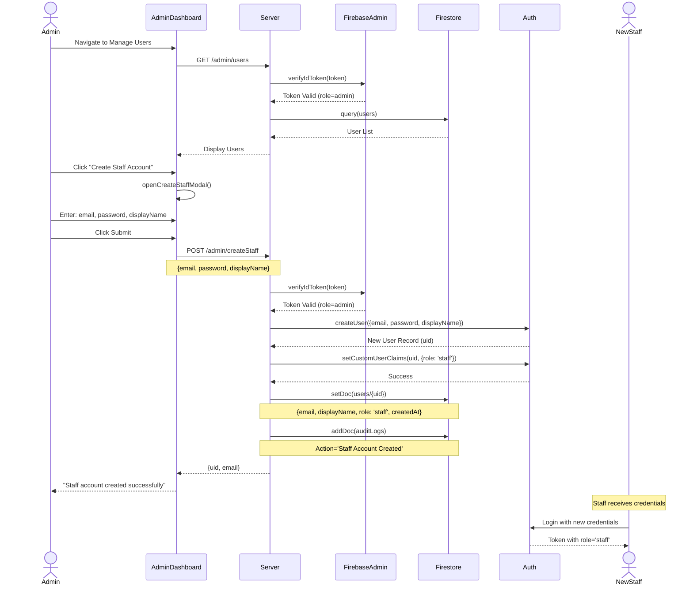

### 4.4 Content Management Flow

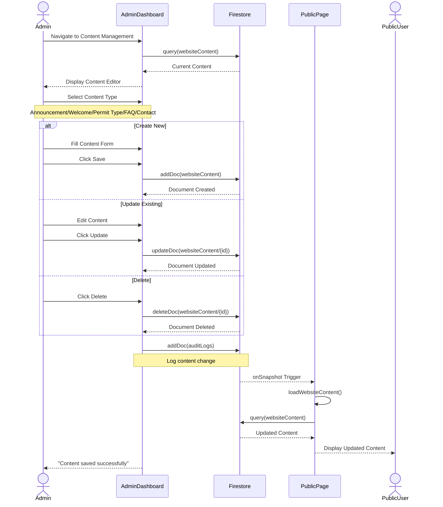

### 4.5 File Upload & Storage Flow

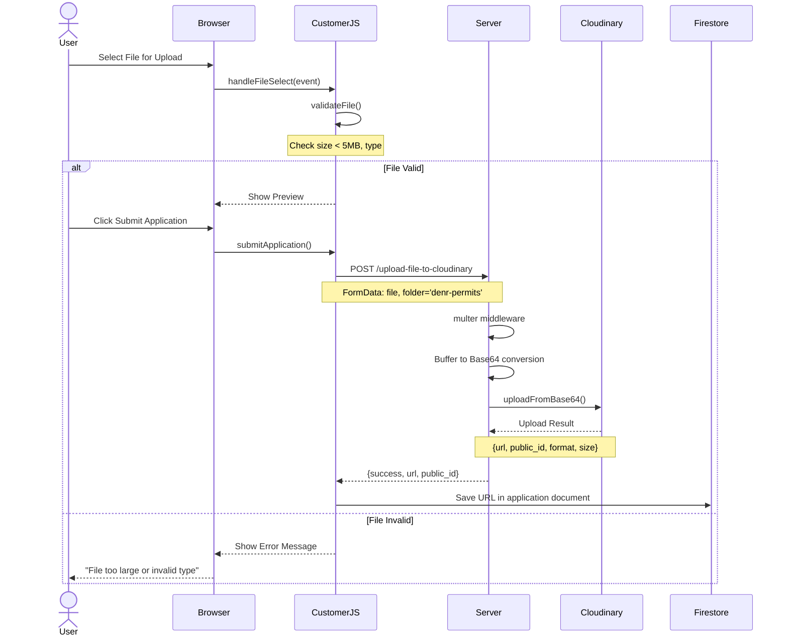

---

## 5. Database Schema Relationships

### 5.1 Entity Relationship Diagram

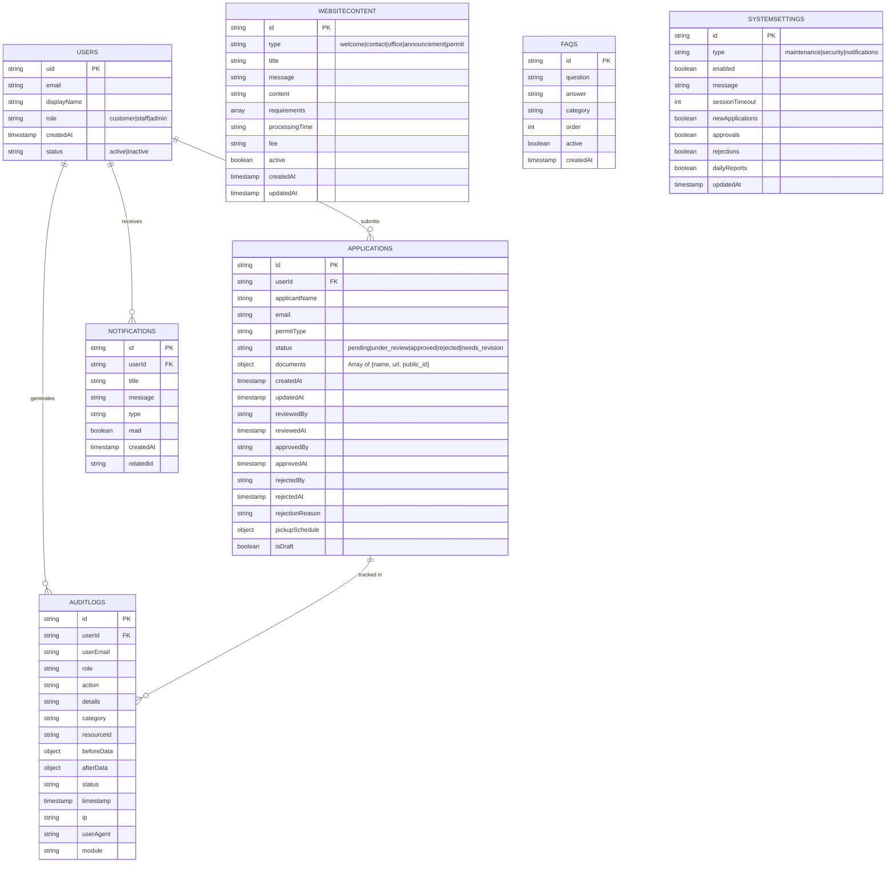

### 5.2 Data Flow by Collection

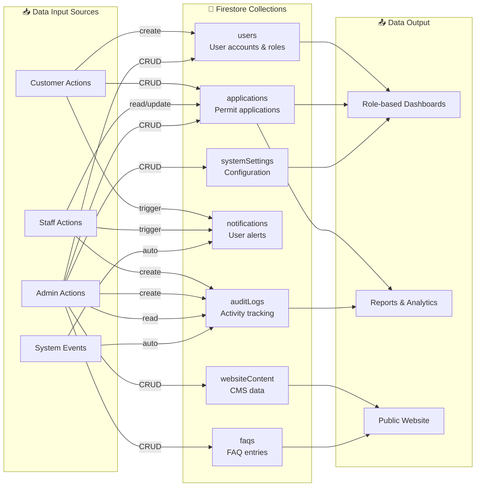

---

## Appendix: API Endpoint Summary

### Authentication Endpoints
| Endpoint | Method | Description | Auth Required |
|----------|--------|-------------|---------------|
| Firebase Auth SDK | - | Client-side auth | No |

### Customer Endpoints
| Endpoint | Method | Description | Auth Required |
|----------|--------|-------------|---------------|
| Firestore SDK | - | CRUD operations | Yes |
| `/upload-file-to-cloudinary` | POST | File upload | Yes |

### Staff Endpoints
| Endpoint | Method | Description | Auth Required |
|----------|--------|-------------|---------------|
| `/staff/updateApplicationStatus` | POST | Update application status | Yes (staff/admin) |

### Admin Endpoints
| Endpoint | Method | Description | Auth Required |
|----------|--------|-------------|---------------|
| `/admin/createStaff` | POST | Create staff account | Yes (admin) |
| `/admin/verify-role` | GET | Verify user role | Yes |
| `/admin/analytics` | GET | Get dashboard stats | Yes (admin/staff) |
| `/admin/users` | GET | List all users | Yes (admin) |
| `/admin/users/:id/status` | POST | Update user status | Yes (admin) |
| `/admin/audit-logs` | GET | Get audit logs | Yes (admin) |
| `/admin/audit-log` | POST | Create audit log | Yes |

### File Management Endpoints
| Endpoint | Method | Description | Auth Required |
|----------|--------|-------------|---------------|
| `/upload-file-to-cloudinary` | POST | Upload file | Yes |
| `/upload-to-cloudinary` | POST | Upload base64 | Yes |
| `/delete-from-cloudinary/:id` | DELETE | Delete file | Yes |
| `/download-file/:id/:filename` | GET | Download file | Yes |

### Debug Endpoints
| Endpoint | Method | Description | Auth Required |
|----------|--------|-------------|---------------|
| `/debug/my-role` | GET | Check current role | Yes |
| `/debug/set-staff-role` | POST | Set staff role (testing) | Yes |
| `/debug/create-audit-log` | POST | Create test audit log | Yes |
| `/health` | GET | Health check | No |
